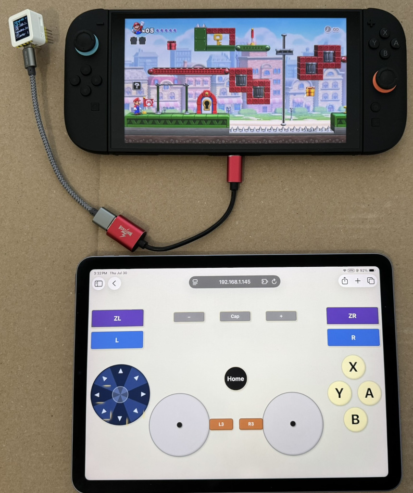

# TGPad-NS — WiFi Touch Gamepad for Nintendo Switch

WiFi gamepad running on an ESP32-S3 that appears as a **Nintendo Switch-compatible controller** over USB.
Control it from any browser — no software installation on the Switch or the tablet.
The Switch is not modded or rooted.

Built on the [ESP32nslite](https://github.com/controllercustom/ESP32nslite) library.

## Features
- **USB HID**: 14-button NSLite gamepad
- **Web UI**: Nintendo-layout gamepad with analog sticks, D-pad, face buttons (A/B/X/Y), ZL/ZR, L/R, Home, Capture, etc.
- **WiFi**: Auto-config via WiFiManager captive portal (`TGPad-NS-Config` AP)
- **Multi-client**: Up to 5 simultaneous WebSocket clients
- **OTA**: ArduinoOTA + web-based firmware update (optional password auth via `#define OTA_PASS`)



*Browser-based gamepad UI shown on a tablet in landscape — face buttons, D-pad (looks better in newer firmware versions), analog sticks, bumpers/triggers, Home/Capture, L3/R3.
The small white box is the M5Stack AtomS3.*

## Supported Boards
| Board | FQBN | Notes |
|-------|------|-------|
| Generic ESP32-S3 dev module | `esp32:esp32:esp32s3:USBMode=default,CDCOnBoot=default` | Default target, verified ✅ |
| M5Stack AtomS3 (8MB) | `esp32:esp32:m5stack_atoms3:PartitionScheme=default_8MB,USBMode=default,CDCOnBoot=default` | Verified ✅ |

## Web Flasher
Flash the firmware directly from your browser at https://controllercustom.github.io/tgpadns

## Getting Source Code
The project uses git submodules for libraries (`lib/ESP32nslite`, `lib/WiFiManager`, `lib/WebSockets`, `lib/M5GFX`). Clone recursively to fetch them:

```bash
git clone --recursive https://github.com/controllercustom/tgpadns.git
cd tgpadns
```

If you already cloned without `--recursive`:

```bash
cd tgpadns && git submodule update --init --recursive
```

## Build & Upload

Build profiles are defined in `sketch.yaml` — no manual FQBN or library flags needed. The default profile is **atoms3**. Use Arduino CLI 1.5+ for profile support.

```bash
# Compile (default: M5Stack AtomS3)
arduino-cli compile .

# Generic ESP32-S3
arduino-cli compile --profile esp32s3 .

# Serial upload — board must be in download mode (BOOT button held)
arduino-cli upload -p /dev/ttyACM0 --profile atoms3 .    # AtomS3
arduino-cli upload -p /dev/ttyUSB0 --profile esp32s3 .   # Generic ESP32-S3

# OTA upload — board must have WiFi connected
arduino-cli compile --output-dir /tmp/tgap_ota_build . && \
  arduino-cli upload -p tgpadns.local --upload-field password="" \
     --protocol network --profile atoms3 --input-dir /tmp/tgap_ota_build .

# Fallback OTA (espota.py) — check exit code, not progress output:
ESPOTA=~/.arduino15/packages/esp32/hardware/esp32/3.3.10/tools/espota.py
python3 "$ESPOTA" -r -i <IP> -p 3232 --auth="" \
  -f /tmp/tgap_ota_build/tgpadns.ino.bin; echo "EXIT=$?"

# Fallback OTA (web update, HTTP port 80):
curl -F "firmware=@/tmp/tgap_ota_build/tgpadns.ino.bin" http://<IP>/update; echo "EXIT=$?"
```

> **Note:** espota.py and curl produce `\r` progress bars that are unreliable in automated environments. Always check exit code (`$?`) to verify success: 0 = OK, non-zero = failure.

## Testing
```bash
pip3 install -r test/requirements.txt

# Offline unit tests (no hardware needed)
python3 -m pytest test/ -v --ignore=test/e2e

# Hardware e2e tests — requires root for evdev, set host IP via env var
sudo python3 -m pytest test/e2e -v

# Full e2e with multi-client tests enabled (requires generic ESP32-S3)
sudo TGAPDNS_MULTICLIENT=1 python3 -m pytest test/e2e -v
```

- Multi-client e2e tests are **skipped by default**. Enable with `TGAPDNS_MULTICLIENT=1` (requires a generic ESP32-S3 dev module; AtomS3 reports slot 0 for every client so OR-combine cannot be verified there). See `test/conftest.py`.

## Verified Status
- **Offline tests**: 23/23 passing (button mapping, stick scaling, d-pad remapping, multi-client state)
- **Hardware e2e** (AtomS3): 6 passed — B button, face buttons, shoulder/menu buttons, left stick axis, D-pad hat, sticky watchdog survival
- **Hardware e2e + multiclient** (generic ESP32-S3): 10/10 passed — all basic tests plus two-client independent, same-button no-stuck, L3 disconnect, four-step L3+R3

## Related Project

- [One Finger Touch Screen WASD Keyboard](https://github.com/controllercustom/touchwasd)
- [Touch Screen QWERTY Assistive Keyboard](https://github.com/controllercustom/ikeys)

## License
MIT
